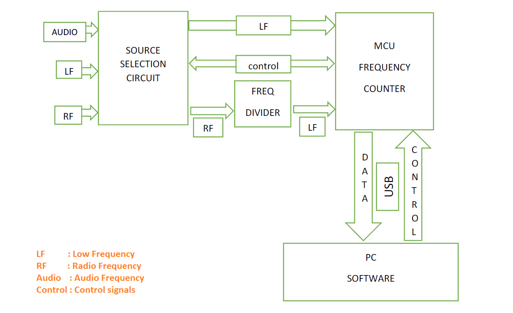

# Frequency-measurement-via-USB
Frequency measurement GUI inferface with MicroChip PIC 18F4550 controller USB

## Softwares used
GUI Software done with VB.NET - Visual studio 2013

PIC controller firmware done with MPLab v 8.36 and HIGH-TECH C compiler

### Architecture

The system architecture is shown below

### Description

The detailed [report](Docs/Report.pdf) and [datasheet](Docs/Datasheet.pdf) is provided in the [Docs](Docs/) folder.